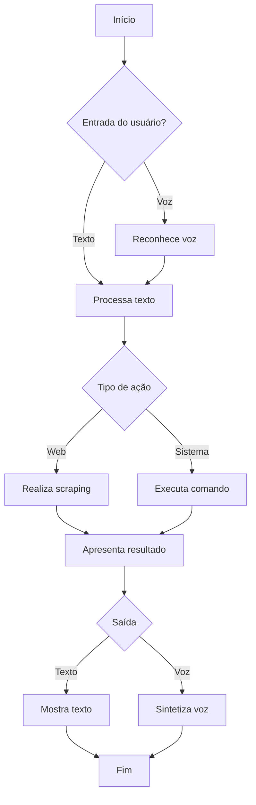

```mermaid
flowchart TD
    A[Início] --> B{Entrada do usuário?}
    B -->|Texto| C[Processa texto]
    B -->|Voz| D[Reconhece voz]
    D --> C
    C --> E{Tipo de ação}
    E -->|Web| F[Realiza scraping]
    E -->|Sistema| G[Executa comando]
    F --> H[Apresenta resultado]
    G --> H
    H --> I{Saída}
    I -->|Texto| J[Mostra texto]
    I -->|Voz| K[Sintetiza voz]
    J --> L[Fim]
    K --> L
``` 
